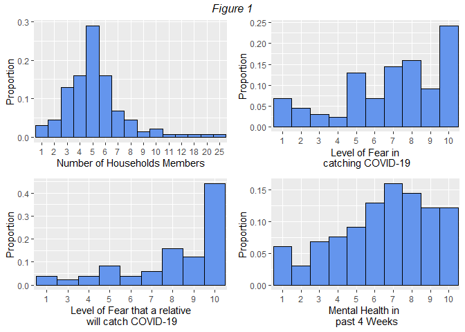

# Current Level of Fear of Coronavirus Disease (COVID-19)

## 1.1 Introduction

Novel coronavirus disease (COVID-19) began in Wuhan, China in December
2019 and has spread worldwide since then. This new coronavirus disease
turned into an outbreak reaching around the world in as little as three
months showing the serious threat of this outbreak. The first patient
with coronavirus disease was identified in Philippines on January 30,
2020.

It has been 2 years since the spread of coronavirus, to control the
spread, different protocols and restrictions were implemented which
affected people’s daily lives. Due to the infectious power of the
coronavirus and daily cases of infections and reported deaths, people
are scared of being infected with coronavirus disease. With nationwide
COVID-19 vaccinations and decrease in number of active cases,
restrictions are being relaxed and things are slowly getting back to
normal. With the current situation we’re in, are people still scared of
being infected with coronovirus? If yes, to what extent? with a lot of
people getting vaccinated and decrease in active cases are people still
extremely scared of the virus? This study aims to determine the current
level of fear of among Philippine population in getting infected with
coronavirus disease.

With online survey as inadequate sampling technique in mind, the study
was conducted online over span of 10 days from November 2 to November
11, 2021. Participants were 132 residents from different regions around
the Philippines. Google forms were used as a platform to design online
surveys. Respondents were asked about (i) demographic and
epidemiological information (ii) Current level of fear of being infected
with coronavirus disease (iii) Current level of fear of relatives
becoming infected with coronavirus disease (iv) Level of mental health
over the past 4 weeks. Respondents were found from social media platform
such as facebook.

## 1.2 Results and Analysis

Statistical analyses were performed using R software. Shapiro-Wilk test
was used to determine normality of set of data. Statistical tests were
interpreted at 5% significance level.

### 1.2.1 Demographic and Epidemiological data of Respondents

    #Frequency tables for demogaphic and epidemiological information

    library(knitr)
    library(janitor)

    t1 <- tabyl(df$Sex)
    kable(t1 %>%
      arrange(desc(percent)) %>%
      adorn_totals("row") %>%
      adorn_pct_formatting(), col.names=c("Gender","Count","Percent")
      , caption="Table 1: Frequency Table of Gender")

<table>
<caption>Table 1: Frequency Table of
Gender</caption>
<thead>
<tr class="header">
<th style="text-align: left;">Gender</th>
<th style="text-align: right;">Count</th>
<th style="text-align: left;">Percent</th>
</tr>
</thead>
<tbody>
<tr class="odd">
<td style="text-align: left;">Female</td>
<td style="text-align: right;">84</td>
<td style="text-align: left;">63.6%</td>
</tr>
<tr class="even">
<td style="text-align: left;">Male</td>
<td style="text-align: right;">48</td>
<td style="text-align: left;">36.4%</td>
</tr>
<tr class="odd">
<td style="text-align: left;">Total</td>
<td style="text-align: right;">132</td>
<td style="text-align: left;">100.0%</td>
</tr>
</tbody>
</table>

Table 1: Frequency Table of Gender

    t2 <- tabyl(df$Marital_Status)
    kable(t2 %>%
      arrange(desc(percent)) %>%
      adorn_totals("row") %>%
      adorn_pct_formatting(), col.names=c("Marital Status","Count","Percent")
      , caption="Table 2: Frequency Table of Marital Status")

<table>
<thead>
<tr class="header">
<th style="text-align: left;">Marital Status</th>
<th style="text-align: right;">Count</th>
<th style="text-align: left;">Percent</th>
</tr>
</thead>
<tbody>
<tr class="odd">
<td style="text-align: left;">Single</td>
<td style="text-align: right;">112</td>
<td style="text-align: left;">84.8%</td>
</tr>
<tr class="even">
<td style="text-align: left;">Married</td>
<td style="text-align: right;">20</td>
<td style="text-align: left;">15.2%</td>
</tr>
<tr class="odd">
<td style="text-align: left;">Total</td>
<td style="text-align: right;">132</td>
<td style="text-align: left;">100.0%</td>
</tr>
</tbody>
</table>

Table 2: Frequency Table of Marital Status

      
    t3 <- tabyl(df$Age_Group)
    kable(t3 %>%
      arrange(desc(percent)) %>%
      adorn_totals("row") %>%
      adorn_pct_formatting(), col.names=c("Age Group","Count","Percent")
      , caption = "Table 3: Frequency Table of Age Group")

<table>
<thead>
<tr class="header">
<th style="text-align: left;">Age Group</th>
<th style="text-align: right;">Count</th>
<th style="text-align: left;">Percent</th>
</tr>
</thead>
<tbody>
<tr class="odd">
<td style="text-align: left;">Generation Z (1997 through today)</td>
<td style="text-align: right;">77</td>
<td style="text-align: left;">58.3%</td>
</tr>
<tr class="even">
<td style="text-align: left;">Millennials (1981-1996)</td>
<td style="text-align: right;">48</td>
<td style="text-align: left;">36.4%</td>
</tr>
<tr class="odd">
<td style="text-align: left;">Generation X (1965-1980)</td>
<td style="text-align: right;">7</td>
<td style="text-align: left;">5.3%</td>
</tr>
<tr class="even">
<td style="text-align: left;">Total</td>
<td style="text-align: right;">132</td>
<td style="text-align: left;">100.0%</td>
</tr>
</tbody>
</table>

Table 3: Frequency Table of Age Group

    t4 <- tabyl(df$Employment_Status)
    kable(t4 %>%
      arrange(desc(percent)) %>%
      adorn_totals("row") %>%
      adorn_pct_formatting(), col.names=c("Employment Status","Count","Percent"),
      caption="Table 4: Frequency Table of Employment Status")

<table>
<thead>
<tr class="header">
<th style="text-align: left;">Employment Status</th>
<th style="text-align: right;">Count</th>
<th style="text-align: left;">Percent</th>
</tr>
</thead>
<tbody>
<tr class="odd">
<td style="text-align: left;">Unemployed</td>
<td style="text-align: right;">72</td>
<td style="text-align: left;">54.5%</td>
</tr>
<tr class="even">
<td style="text-align: left;">Employed</td>
<td style="text-align: right;">60</td>
<td style="text-align: left;">45.5%</td>
</tr>
<tr class="odd">
<td style="text-align: left;">Total</td>
<td style="text-align: right;">132</td>
<td style="text-align: left;">100.0%</td>
</tr>
</tbody>
</table>

Table 4: Frequency Table of Employment Status

    t5 <- tabyl(df$Region)
    kable(t5 %>%
      arrange(desc(percent)) %>%
      adorn_totals("row") %>%
      adorn_pct_formatting(), col.names=c("Region","Count","Percent")
      , caption = "Table 5: Frequency Table of Region")

<table>
<thead>
<tr class="header">
<th style="text-align: left;">Region</th>
<th style="text-align: right;">Count</th>
<th style="text-align: left;">Percent</th>
</tr>
</thead>
<tbody>
<tr class="odd">
<td style="text-align: left;">NCR - National Capital Region</td>
<td style="text-align: right;">98</td>
<td style="text-align: left;">74.2%</td>
</tr>
<tr class="even">
<td style="text-align: left;">CALABARZON</td>
<td style="text-align: right;">18</td>
<td style="text-align: left;">13.6%</td>
</tr>
<tr class="odd">
<td style="text-align: left;">Central Luzon</td>
<td style="text-align: right;">6</td>
<td style="text-align: left;">4.5%</td>
</tr>
<tr class="even">
<td style="text-align: left;">Cagayan Valley</td>
<td style="text-align: right;">4</td>
<td style="text-align: left;">3.0%</td>
</tr>
<tr class="odd">
<td style="text-align: left;">Bicol Region</td>
<td style="text-align: right;">3</td>
<td style="text-align: left;">2.3%</td>
</tr>
<tr class="even">
<td style="text-align: left;">Davao Region</td>
<td style="text-align: right;">1</td>
<td style="text-align: left;">0.8%</td>
</tr>
<tr class="odd">
<td style="text-align: left;">Northern Mindanao</td>
<td style="text-align: right;">1</td>
<td style="text-align: left;">0.8%</td>
</tr>
<tr class="even">
<td style="text-align: left;">Western Visayas</td>
<td style="text-align: right;">1</td>
<td style="text-align: left;">0.8%</td>
</tr>
<tr class="odd">
<td style="text-align: left;">Total</td>
<td style="text-align: right;">132</td>
<td style="text-align: left;">100.0%</td>
</tr>
</tbody>
</table>

Table 5: Frequency Table of Region

    #CVDTEST, CVDVACCINE, and CVDVACCINEB

    t1 <- tabyl(df$CVDTEST)
    kable(t1 %>%
      arrange(desc(percent)) %>%
      adorn_totals("row") %>%
      adorn_pct_formatting(), col.names=c("Tested Positive","Count","Percent")
      , caption="Table 6: Frequency Table of Respondents who Tested Positive for COVID-19")

<table>
<thead>
<tr class="header">
<th style="text-align: left;">Tested Positive</th>
<th style="text-align: right;">Count</th>
<th style="text-align: left;">Percent</th>
</tr>
</thead>
<tbody>
<tr class="odd">
<td style="text-align: left;">No</td>
<td style="text-align: right;">110</td>
<td style="text-align: left;">83.3%</td>
</tr>
<tr class="even">
<td style="text-align: left;">Yes</td>
<td style="text-align: right;">22</td>
<td style="text-align: left;">16.7%</td>
</tr>
<tr class="odd">
<td style="text-align: left;">Total</td>
<td style="text-align: right;">132</td>
<td style="text-align: left;">100.0%</td>
</tr>
</tbody>
</table>

Table 6: Frequency Table of Respondents who
Tested Positive for COVID-19

    t2 <- tabyl(df$CVDVACCINE)
    kable(t2 %>%
      arrange(desc(percent)) %>%
      adorn_totals("row") %>%
      adorn_pct_formatting(), col.names=c("Vaccinated","Count","Percent")
      , caption="Table 7: Frequency Table of Vaccinated Respondents")

<table>
<thead>
<tr class="header">
<th style="text-align: left;">Vaccinated</th>
<th style="text-align: right;">Count</th>
<th style="text-align: left;">Percent</th>
</tr>
</thead>
<tbody>
<tr class="odd">
<td style="text-align: left;">Yes</td>
<td style="text-align: right;">118</td>
<td style="text-align: left;">89.4%</td>
</tr>
<tr class="even">
<td style="text-align: left;">No</td>
<td style="text-align: right;">14</td>
<td style="text-align: left;">10.6%</td>
</tr>
<tr class="odd">
<td style="text-align: left;">Total</td>
<td style="text-align: right;">132</td>
<td style="text-align: left;">100.0%</td>
</tr>
</tbody>
</table>

Table 7: Frequency Table of Vaccinated
Respondents

    df.vaccinated <- df[df$CVDVACCINE=="Yes",]

    t3 <- tabyl(df$CVDVACCINE)
    kable(t3 %>%
      arrange(desc(percent)) %>%
      adorn_totals("row") %>%
      adorn_pct_formatting(), col.names=c("Vaccine Brand","Count","Percent")
      , caption="Table 8: Frequency Table of COVID-19 Vaccine")

<table>
<thead>
<tr class="header">
<th style="text-align: left;">Vaccine Brand</th>
<th style="text-align: right;">Count</th>
<th style="text-align: left;">Percent</th>
</tr>
</thead>
<tbody>
<tr class="odd">
<td style="text-align: left;">Yes</td>
<td style="text-align: right;">118</td>
<td style="text-align: left;">89.4%</td>
</tr>
<tr class="even">
<td style="text-align: left;">No</td>
<td style="text-align: right;">14</td>
<td style="text-align: left;">10.6%</td>
</tr>
<tr class="odd">
<td style="text-align: left;">Total</td>
<td style="text-align: right;">132</td>
<td style="text-align: left;">100.0%</td>
</tr>
</tbody>
</table>

Table 8: Frequency Table of COVID-19 Vaccine

### 1.2.2 Numerical Summaries

    #NumHH, PF, RF, MHEALTH

    library(pastecs)
    attach(df)
    num <- cbind(NumHH, PF, RF, MHEALTH)
    options(scipen = 100, digits=2)
    kable(stat.desc(num, basic=F),
          caption = "Table 9: Numerical Summaries of Number of Household Members, Level of Fear of Being infected with COVID-19, and Level of Fear of Relative becoming Infected with COVID-19")

<table>
<thead>
<tr class="header">
<th style="text-align: left;"></th>
<th style="text-align: right;">NumHH</th>
<th style="text-align: right;">PF</th>
<th style="text-align: right;">RF</th>
<th style="text-align: right;">MHEALTH</th>
</tr>
</thead>
<tbody>
<tr class="odd">
<td style="text-align: left;">median</td>
<td style="text-align: right;">5.00</td>
<td style="text-align: right;">7.00</td>
<td style="text-align: right;">9.00</td>
<td style="text-align: right;">7.00</td>
</tr>
<tr class="even">
<td style="text-align: left;">mean</td>
<td style="text-align: right;">5.39</td>
<td style="text-align: right;">6.92</td>
<td style="text-align: right;">8.08</td>
<td style="text-align: right;">6.42</td>
</tr>
<tr class="odd">
<td style="text-align: left;">SE.mean</td>
<td style="text-align: right;">0.27</td>
<td style="text-align: right;">0.24</td>
<td style="text-align: right;">0.21</td>
<td style="text-align: right;">0.22</td>
</tr>
<tr class="even">
<td style="text-align: left;">CI.mean.0.95</td>
<td style="text-align: right;">0.54</td>
<td style="text-align: right;">0.48</td>
<td style="text-align: right;">0.42</td>
<td style="text-align: right;">0.44</td>
</tr>
<tr class="odd">
<td style="text-align: left;">var</td>
<td style="text-align: right;">9.80</td>
<td style="text-align: right;">7.62</td>
<td style="text-align: right;">5.91</td>
<td style="text-align: right;">6.64</td>
</tr>
<tr class="even">
<td style="text-align: left;">std.dev</td>
<td style="text-align: right;">3.13</td>
<td style="text-align: right;">2.76</td>
<td style="text-align: right;">2.43</td>
<td style="text-align: right;">2.58</td>
</tr>
<tr class="odd">
<td style="text-align: left;">coef.var</td>
<td style="text-align: right;">0.58</td>
<td style="text-align: right;">0.40</td>
<td style="text-align: right;">0.30</td>
<td style="text-align: right;">0.40</td>
</tr>
</tbody>
</table>

Table 9: Numerical Summaries of Number of
Household Members, Level of Fear of Being infected with COVID-19, and
Level of Fear of Relative becoming Infected with COVID-19

    #Graph of NumHH, PF, RF, MHEALTH
    library(grid)

    p1 <- ggplot(df, aes(x=as.factor(NumHH))) + geom_bar(width=1, color="black", fill="cornflowerblue", aes(y=..prop.., group=1)) + labs(x="Number of Households Members", y="Proportion")
    p2 <- ggplot(df, aes(x=as.factor(PF))) + geom_bar(width=1, color="black", fill="cornflowerblue",aes(y=..prop.., group=1)) + labs(x="Level of Fear in\n catching COVID-19", y="Proportion")
    p3 <- ggplot(df, aes(x=as.factor(RF))) + geom_bar(width=1, color="black", fill="cornflowerblue", aes(y=..prop.., group=1)) + labs(x="Level of Fear that a relative\n will catch COVID-19", y="Proportion")
    p4 <- ggplot(df, aes(x=as.factor(MHEALTH))) + geom_bar(width=1, color="black", fill="cornflowerblue", aes(y=..prop.., group=1)) + labs(x="Mental Health in \n past 4 Weeks", y="Proportion")

    grid.arrange(p1, p2, p3, p4, ncol=2, top=textGrob("Figure 1",gp=gpar(font=3)))

Figure 1 shows the distribution of number household members, fear of
being infected with COVID-19, fear of relatives becoming infected with
COVID-19, and mental health of the respondents. It shows that the
average number of household members is around five. More than 70% of the
respondents have high level of fear in catching COVID-19. Respondents’
was much higher with 80% of them reporting their fear higher than five.
Mental health of the respondents are still high with 67% of them
reporting their mental health higher than five.

    p1 <- ggplot(df, aes(x=Sex, y=PF, fill=Sex)) + geom_boxplot()
    p2 <- ggplot(df, aes(x=Sex, y=RF, fill=Sex)) + geom_boxplot()

    grid.arrange(p1, p2, ncol=2, top=textGrob("Figure 2",gp=gpar(font=3)))

Figure 2 shows that Females have higher level of fear in catching
COVID-19 compared to males. Females also have higher level of fear that
a relative will catch COVID-19 compared to males.

    p1 <- ggplot(df, aes(x=Regionv2, y=PF, fill=Regionv2)) + geom_boxplot()
    p2 <- ggplot(df, aes(x=Regionv2, y=RF, fill=Regionv2)) + geom_boxplot()

    grid.arrange(p1, p2, ncol=1, top=textGrob("Figure 3",gp=gpar(font=3)))

Figure 3 shows there is no significant difference in the level of fear
between NCR and areas outside NCR.

    p1 <- ggplot(df, aes(x=Age_Group, y=PF, fill=Age_Group)) + geom_boxplot() + theme(axis.title.x = element_blank(), axis.text.x = element_blank())
    p2 <- ggplot(df, aes(x=Age_Group, y=RF, fill=Age_Group)) + geom_boxplot() +
    theme(axis.title.x = element_blank(), axis.text.x = element_blank())

    grid.arrange(p1, p2, ncol=1, top=textGrob("Figure 4",gp=gpar(font=3)))

Figure 4 shows there is significant difference in the level of fear of
catching COVID-19 between age group. However after statistical test,
with p-value=0.2, it was determined that there is no significant
difference in the level of fear of catching COVID-19 between age group.
Figure 4 also shows there is significant difference in the level of fear
that a relative will catch COVID-19 between age groups. After
statistical test, with p-value =0.02, the significant difference was
confirmed.

    p1 <- ggplot(df, aes(x=Employment_Status, y=PF, fill=Employment_Status)) + geom_boxplot()
    p2 <- ggplot(df, aes(x=Employment_Status, y=RF, fill=Employment_Status)) + geom_boxplot()

    grid.arrange(p1, p2, ncol=1, top=textGrob("Figure 5",gp=gpar(font=3)))

Figure 5 shows there is no significant difference in the level of fear
of catching COVID-19 between employed and unemployed repondents.

    p1 <- ggplot(df, aes(x=CVDVACCINE, y=PF, fill=CVDVACCINE)) + geom_boxplot()
    p2 <- ggplot(df, aes(x=CVDVACCINE, y=RF, fill=CVDVACCINE)) + geom_boxplot()

    grid.arrange(p1, p2, ncol=1, top=textGrob("Figure 6",gp=gpar(font=3)))

Figure 6 shows there is no significant difference in level of fear of
catching COVID-19 between vaccinated and unvaccinated respondents.

    p1 <- ggplot(df, aes(x=CVDTEST, y=PF, fill=CVDTEST)) + geom_boxplot()
    p2 <- ggplot(df, aes(x=CVDTEST, y=RF, fill=CVDTEST)) + geom_boxplot()

    grid.arrange(p1, p2, ncol=1, top=textGrob("Figure 7",gp=gpar(font=3)))

Figure 7 shows there is significant difference in the level of fear
being infected with COVID-19 between respondents who already got
infected compared to respondents who are not yet infected by the virus.

### 1.2.3 Spearman Correlation Coefficient

    library(Hmisc)
    w <- rcorr(as.matrix(num), type="spearman")
    kable(w[1], caption="Correlation Coefficient")

<table class="kable_wrapper">
<tbody>
<tr>
<td>

<table>
<thead>
<tr class="header">
<th style="text-align: left;"></th>
<th style="text-align: right;">NumHH</th>
<th style="text-align: right;">PF</th>
<th style="text-align: right;">RF</th>
<th style="text-align: right;">MHEALTH</th>
</tr>
</thead>
<tbody>
<tr class="odd">
<td style="text-align: left;">NumHH</td>
<td style="text-align: right;">1.00</td>
<td style="text-align: right;">-0.09</td>
<td style="text-align: right;">0.02</td>
<td style="text-align: right;">-0.08</td>
</tr>
<tr class="even">
<td style="text-align: left;">PF</td>
<td style="text-align: right;">-0.09</td>
<td style="text-align: right;">1.00</td>
<td style="text-align: right;">0.68</td>
<td style="text-align: right;">0.06</td>
</tr>
<tr class="odd">
<td style="text-align: left;">RF</td>
<td style="text-align: right;">0.02</td>
<td style="text-align: right;">0.68</td>
<td style="text-align: right;">1.00</td>
<td style="text-align: right;">-0.09</td>
</tr>
<tr class="even">
<td style="text-align: left;">MHEALTH</td>
<td style="text-align: right;">-0.08</td>
<td style="text-align: right;">0.06</td>
<td style="text-align: right;">-0.09</td>
<td style="text-align: right;">1.00</td>
</tr>
</tbody>
</table>

</td>
</tr>
</tbody>
</table>

    kable(w[3], caption="p-values")

<table class="kable_wrapper">
<caption>
Table 1.1: p-values
</caption>
<tbody>
<tr>
<td>

<table>
<thead>
<tr class="header">
<th style="text-align: left;"></th>
<th style="text-align: right;">NumHH</th>
<th style="text-align: right;">PF</th>
<th style="text-align: right;">RF</th>
<th style="text-align: right;">MHEALTH</th>
</tr>
</thead>
<tbody>
<tr class="odd">
<td style="text-align: left;">NumHH</td>
<td style="text-align: right;">NA</td>
<td style="text-align: right;">0.29</td>
<td style="text-align: right;">0.8</td>
<td style="text-align: right;">0.36</td>
</tr>
<tr class="even">
<td style="text-align: left;">PF</td>
<td style="text-align: right;">0.29</td>
<td style="text-align: right;">NA</td>
<td style="text-align: right;">0.0</td>
<td style="text-align: right;">0.48</td>
</tr>
<tr class="odd">
<td style="text-align: left;">RF</td>
<td style="text-align: right;">0.80</td>
<td style="text-align: right;">0.00</td>
<td style="text-align: right;">NA</td>
<td style="text-align: right;">0.30</td>
</tr>
<tr class="even">
<td style="text-align: left;">MHEALTH</td>
<td style="text-align: right;">0.36</td>
<td style="text-align: right;">0.48</td>
<td style="text-align: right;">0.3</td>
<td style="text-align: right;">NA</td>
</tr>
</tbody>
</table>

</td>
</tr>
</tbody>
</table>

## 1.3 Conclusion

Despite the nationwide COVID-19 vaccination for protection against
COVID-19 and with the decrease in number of active cases, with COVID-19
known for being deadly, the level of fear of being infected with
COVID-19 of the respondents are still high. Respondents’ level of fear
that a relative will catch the virus was higher than the fear they had
for catching the virus itself. There is moderate positive linear
relationship between level of fear of being infected with COVID-19 and
the level of fear of a relative becoming infected with COVID-19. Female
respondents have higher level of fear of COVID-19 than male respondents.
With COVID-19 known to be highly deadly among elders, respondents from
generation X have lower level of fear that a relative will catch
COVID-19 compared to respondents from millennials and generation Z.
There’s no difference in the level of fear of COVID-19 between
vaccinated and unvaccinated respondents. Furthermore, fear of COVID-19
is the same regardless of their area of residence and type of
employment. Despite the pandemic, the respondents mental health are
still in good condition.

## 1.4 Appendix

<table>
<colgroup>
<col style="width: 11%" />
<col style="width: 88%" />
</colgroup>
<thead>
<tr class="header">
<th style="text-align: left;">Variable Name</th>
<th style="text-align: left;">Description</th>
</tr>
</thead>
<tbody>
<tr class="odd">
<td style="text-align: left;">Timestamp</td>
<td style="text-align: left;">Date and time of the response</td>
</tr>
<tr class="even">
<td style="text-align: left;">Email</td>
<td style="text-align: left;">Email address of the respondent</td>
</tr>
<tr class="odd">
<td style="text-align: left;">Sex</td>
<td style="text-align: left;">Gender of the respondent</td>
</tr>
<tr class="even">
<td style="text-align: left;">Marital Status</td>
<td style="text-align: left;">Marital status of the repondent</td>
</tr>
<tr class="odd">
<td style="text-align: left;">Age Group</td>
<td style="text-align: left;">Age Group of the respondent, Millenials,
Generation Z, Generation X</td>
</tr>
<tr class="even">
<td style="text-align: left;">Employment Status</td>
<td style="text-align: left;">Employment status of the respondent</td>
</tr>
<tr class="odd">
<td style="text-align: left;">Work setup</td>
<td style="text-align: left;">Work setup of respondent if employed (work
from home, onsite, hybrid)</td>
</tr>
<tr class="even">
<td style="text-align: left;">Region</td>
<td style="text-align: left;">Region where the respondent currently
lives</td>
</tr>
<tr class="odd">
<td style="text-align: left;">NumHH</td>
<td style="text-align: left;">Number of household members</td>
</tr>
<tr class="even">
<td style="text-align: left;">CVDTEST</td>
<td style="text-align: left;">Yes if respondent have been tested
positive for COVID-19, No if otherwise</td>
</tr>
<tr class="odd">
<td style="text-align: left;">CVDVACCINE</td>
<td style="text-align: left;">Yes if respondent have been vaccinated for
COVID-19, No if otherwise</td>
</tr>
<tr class="even">
<td style="text-align: left;">CVDVACCINEB</td>
<td style="text-align: left;">COVID-19 vaccine brand</td>
</tr>
<tr class="odd">
<td style="text-align: left;">PF</td>
<td style="text-align: left;">Rate of fear of the respondent for
catching the coronavirus disease (COVID-19),1-10, 1 as never scared, 10
as extremely scared</td>
</tr>
<tr class="even">
<td style="text-align: left;">RF</td>
<td style="text-align: left;">Rate of fear of the respondent for a
relative catching the coronavirus disease (COVID-19), 1-10, 1 as never
scared, 10 as extremely scared</td>
</tr>
<tr class="odd">
<td style="text-align: left;">MHEALTH</td>
<td style="text-align: left;">Rate of mental health of the respondent
for the past 4 weeks, 1-10, 1 as poor, 10 as very good</td>
</tr>
</tbody>
</table>
